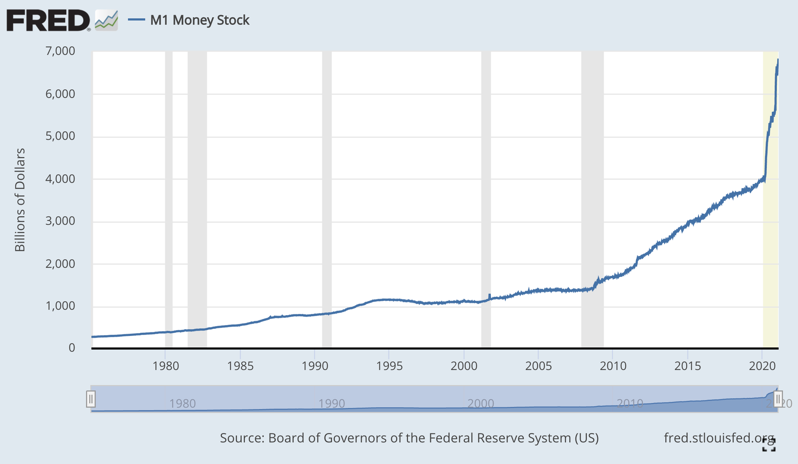
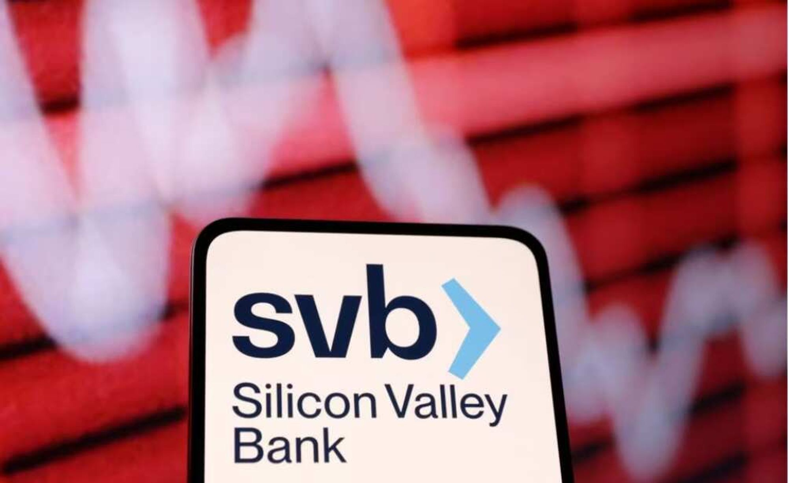
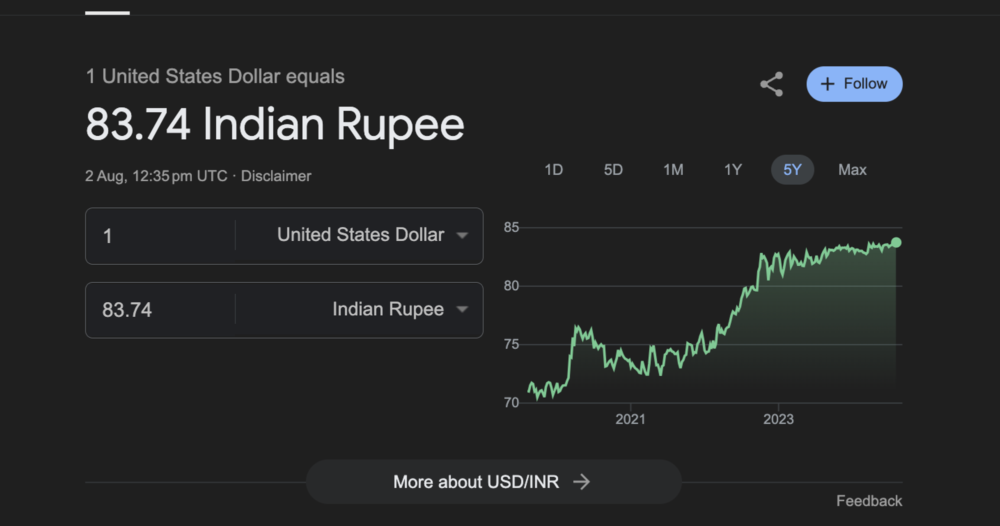
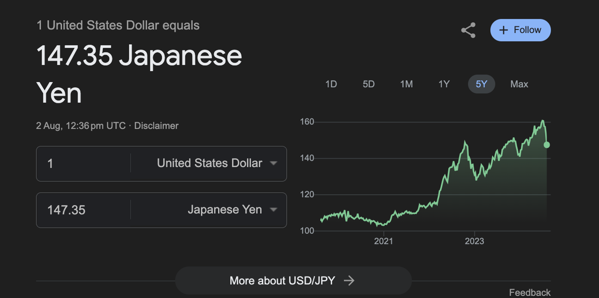

# Week 1: Orientation 

### Contents:
- [**Why blockchains?**](#why-blockchains)
    - [**Inflating Currencies**](#inflating-currencies)
    - [**Fractional Reserve Banking**](#fractional-reserve-banking)
    - [**Bailouts**](#bailouts)
    - [**Depreciation**](#depreciation)

### Why blockchains?
The issues surrounding *inflating currencies*, *fractional reserve banking*, *bailouts*, and *depreciation* have collectively highlighted the need for more robust and transparent financial systems, leading to the development of blockchain technology.

#### Inflating Currencies
- **Inflating currencies** refer to the increase in the money supply within an economy, leading to a decrease in the purchasing power of the currency.

- Holding on to cash is a losers bet in the long run. Holding on to any asset (Gold, Stock, real estate) is better compared to currencies like USD, INR.

- **Effect:**
    - **Devaluation:** The increase in money supply often leads to higher prices for goods and services, reducing the currency's purchasing power. Consumers find that their money buys less than before, leading to decreased consumer confidence and spending.
    - **Economic Instability:** Persistent inflation can create uncertainty in the economy. Businesses may struggle with planning and pricing, and consumers may delay purchases in anticipation of higher future prices, disrupting economic stability and growth.
    - **Savings Erosion:** Inflation erodes the real value of savings, meaning that money saved today will have less purchasing power in the future. This discourages saving and can lead to reduced investment in the economy.
    - **Income Inequality:** Inflation tends to disproportionately affect low-income individuals who do not have significant investments or assets that appreciate over time. Wealthy individuals can often hedge against inflation by investing in assets like real estate or stocks, widening the gap between rich and poor.
- **How It Leads to Blockchain Development:** 
    - Inflation erodes trust in fiat currencies and centralized monetary systems. Blockchain technology, exemplified by cryptocurrencies like Bitcoin, offers an alternative by providing a decentralized and transparent ledger system. Cryptocurrencies often have capped supplies or are regulated by algorithms, reducing inflation risk and enhancing stability and predictability in the monetary system.

#### Fractional Reserve Banking
-  **Fractional reserve banking** is a banking system where banks hold only a fraction of their deposit liabilities as reserves and lend out the remainder.

- Silicon valley collapsed in 2022. I was in the US when it happened. Most YC companies had their funds in SVB. They were bailed out, but if not, you would’ve seen a lot of startups die

- **Effect:**
    - **Credit Creation:** By lending out a portion of their deposits, banks can significantly increase the amount of money in circulation. This process can stimulate economic growth by providing businesses and consumers with the funds needed for investment and spending.
    - **Liquidity Risk:** Since banks hold only a fraction of their deposits as reserves, there is a risk that they will not have enough cash on hand to meet all withdrawal demands during a crisis, potentially leading to bank runs.
    - **Economic Growth:** The ability to lend out deposits allows banks to support economic expansion by funding business ventures, real estate purchases, and consumer spending, which drives overall economic growth.
    - **Systemic Risk:** Overextension of credit can lead to financial instability. If borrowers default on their loans, banks can face significant losses, which can ripple through the economy, potentially leading to a financial crisis.
- **How It Leads to Blockchain Development:**
    - The risks associated with fractional reserve banking, such as liquidity crises and systemic risks, highlight the need for a more transparent and stable financial system. Blockchain's decentralized nature allows for a trustless system where transactions are verified by a network of nodes rather than a central authority. This reduces the risk of bank runs and increases trust in the financial system, providing an alternative to traditional banking methods.

#### Bailouts
- **Bailouts** are financial assistance programs provided by governments to prevent the failure of large financial institutions or corporations deemed too important to the economy to fail.

- The 2008 Financial crisis was triggered by a financial instrument called mortgage-backed securities. Even though the banks at Wall Street were at fault, the government ended up bailing them out using Taxpayer money.

- **Effect:**
    **Financial Stability:** Bailouts can stabilize the financial system by preventing the collapse of critical institutions that could cause widespread economic disruption. This intervention helps maintain confidence in the financial system during crises.
    - **Moral Hazard:** The expectation of future bailouts may encourage risky behavior among financial institutions, knowing that they may be rescued if their bets go wrong. This creates a cycle of risk-taking and dependency on government intervention.
    - **Public Cost:** Bailouts are often funded by taxpayers, leading to public dissatisfaction and debates about the fairness of using public money to rescue private companies. This can erode trust in both the government and financial institutions.
    - **Market Distortion:** Bailouts can disrupt natural market mechanisms by preventing poorly managed companies from failing. This interference can hinder competition and innovation, as struggling companies are kept afloat artificially.
- **How It Leads to Blockchain Development:**
    - Bailouts reveal the opaque and interconnected nature of traditional financial systems, creating moral hazards and public dissatisfaction. Blockchain offers a transparent ledger system where all transactions are publicly recorded and verifiable. This transparency reduces the need for opaque bailout mechanisms, preventing risky behavior and reducing the necessity for government bailouts. It promotes a more accountable and self-regulating financial system.

#### Depreciation
- Depreciation is the gradual reduction in the value of an asset over time due to factors such as wear and tear, obsolescence, or market conditions.

- INR Depreciation (even worse in countries like Japan)

- **Effect:**
    **Asset Value Reduction:** Over time, assets lose value due to usage, technological advancements, or market changes. This reduction needs to be accurately reflected in financial statements to give a true picture of a company’s worth.
    - **Tax Benefits:** Depreciation allows businesses to allocate the cost of an asset over its useful life, providing tax deductions. This can reduce taxable income, offering financial relief to businesses.
    - **Accounting Accuracy:** Properly accounting for depreciation ensures that financial statements reflect the true value of assets. This accuracy is crucial for stakeholders making investment or financial decisions based on a company's reported assets.
    - **Economic Implications:** Depreciation impacts investment decisions and capital allocation. Businesses must consider the long-term costs and benefits of maintaining or replacing depreciating assets, influencing their strategic planning and investment.
- **How It Leads to Blockchain Development:**
    - Depreciation affects the accurate valuation of assets, impacting financial planning and investment decisions. Blockchain technology can provide a transparent and immutable record of asset ownership and value changes over time. In industries like real estate, blockchain can offer a decentralized ledger that tracks the history and depreciation of assets, ensuring more accurate and trustworthy valuations. This transparency leads to better investment decisions and more efficient capital allocation, addressing some of the inefficiencies in current asset valuation methods.

The combined issues of inflating currencies, fractional reserve banking, bailouts, and depreciation emphasize the need for a more robust and transparent financial system. Blockchain technology addresses these challenges by offering a decentralized, immutable, and transparent ledger system that enhances trust, reduces risks, and improves efficiency. This makes blockchain a compelling solution to the inherent problems in traditional financial structures.