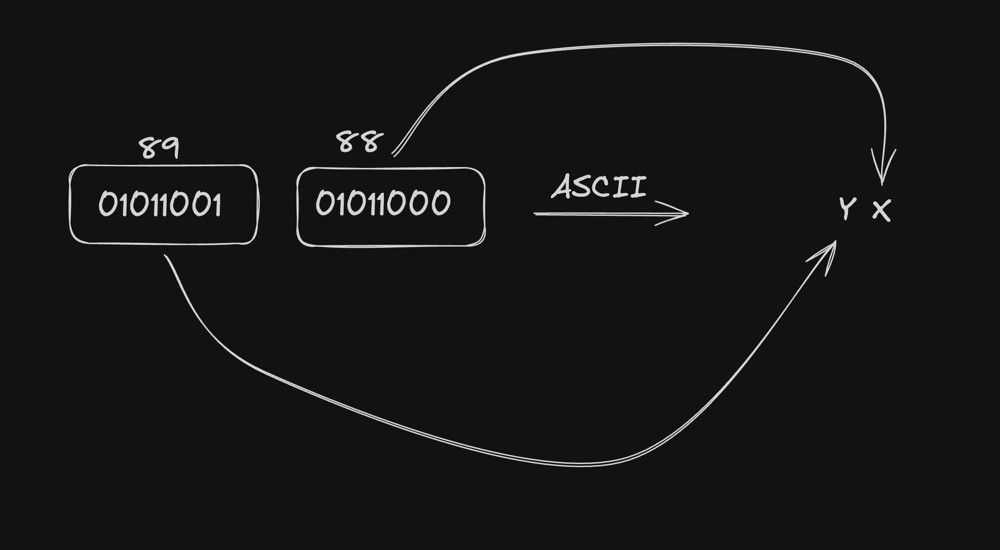
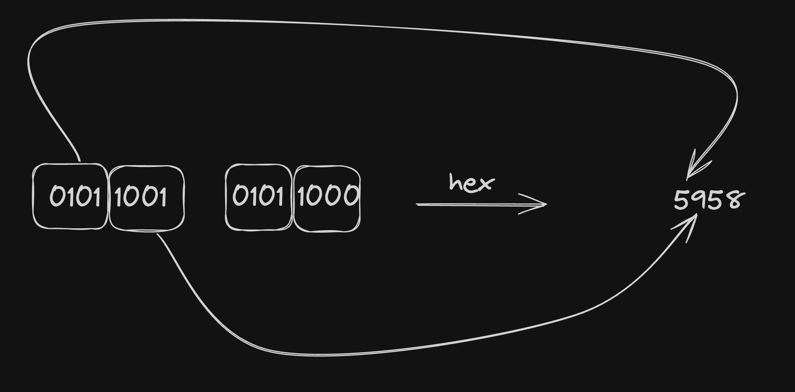
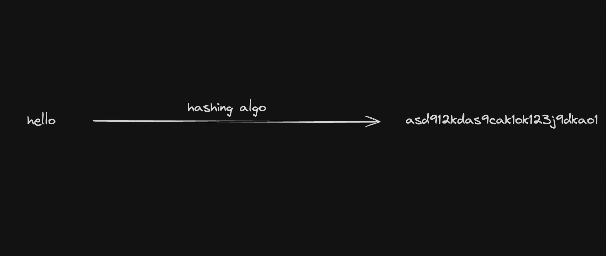
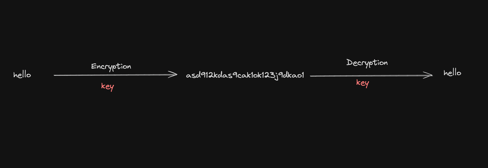
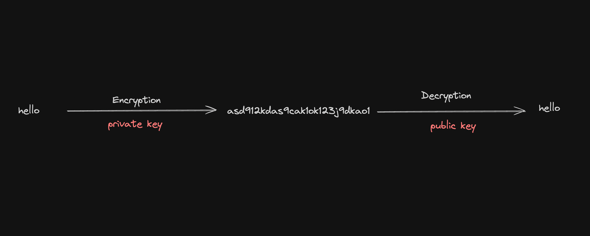

# Week 2: Public key cryptography

### Contents
- [**Banks vs Blockchains**](#banks-vs-blockchains)  
    - [**How do banks authenticate user?**](#how-do-banks-authenticate-user)  
    - [**How do blockchains authenticate user?**](#how-do-blockchains-authenticate-user)
        - [**Public private Key pair**](#public-private-key-pair)
- [**Bits and bytes**](#bits-and-bytes)
    - [**What is a Bit?**](#what-is-a-bit)
    - [**What is a Byte?**](#what-is-a-byte)
    - [**Representing bits and bytes in JS**](#representing-bits-and-bytes-in-js)
    - [**UInt8Array**](#uint8array)
    - [**Why use UInt8Array over native arrays?**](#why-use-uint8array-over-native-arrays)
- [**Encodings**](#encodings)
    - [**ASCII**](#ascii)
        - [**Bytes to ASCII**](#bytes-to-ascii)
        - [**ASCII to bytes**](#ascii-to-bytes)
        - [**UInt8Array to ASCII**](#uint8array-to-ascii)
        - [**ASCII to UInt8Array**](#ascii-to-uint8array)
    - [**HEX**](#hex)
        - [**Array to HEX**](#array-to-hex)
        - [**HEX to Array**](#hex-to-array)
    - [**Base64**](#base64)
        - [**Encode**](#encode)
    - [**Base58**](#base58)
        - [**Encode**](#encode-1)
        - [**Decode**](#decode)
    - [**ASCII VS UTF-8**](#ascii-vs-utf-8)
- [**Hashing VS Encryption**](#hashing-vs-encryption)
    - [**Hashing**](#hashing)
    - [**Encryption**](#encryption)
        - [**Symmetric Encryption**](#symmetric-encryption)
        - [**Asymmetric Encryption**](#asymetric-encryption)
- [**Asymetric Cryptography**](#asymetric-cryptography)
    - [**Common Asymmetric Encryption Algorithms:**](#common-asymetric-encryption-algorithms)
        - [**RSA (Rivest-Shamir-Adleman)**](#rsa-rivest-shamir-adleman)
        - [**Elliptic Curve Cryptography (ECC)**](#elliptic-curve-cryptography-ecc)
    - [**Common Eleptic Curves**](#common-elliptic-curves)
    - [**Few usecases of public key cryptography**](#few-usecases-of-public-key-cryptography)
    


## Banks vs Blockchains
Blockchain and traditional banking systems are both used to manage and record financial transactions, but they operate in fundamentally different ways. Here are the key differences between the two:
1. **Decentralization vs. Centralization**
    - **Blockchain**: Operates on a decentralized network with no single controlling entity. Transactions are validated through consensus mechanisms.
    - **Bank**: Centralized systems where banks control and manage transaction records.

2. **Transparency and Immutability**
    - **Blockchain**: Transactions are transparent and immutable, meaning they cannot be altered once recorded.
    - **Bank**: Transactions are recorded in private ledgers, which can be modified if necessary.

3. **Intermediaries**
    - **Blockchain**: Eliminates the need for intermediaries, allowing peer-to-peer transactions.
    - **Bank**: Acts as intermediaries, which can introduce delays and additional costs.

4. **Access and Inclusion**
    - **Blockchain**: Accessible to anyone with internet access, potentially reaching unbanked populations.
    - **Bank**: Requires customers to meet specific criteria, which may exclude some people.

5. **Security**
    - **Blockchain**: Offers strong security through decentralization and cryptography but can be vulnerable to issues like poor key management.
    - **Bank**: Uses centralized security systems, which can be targets for hacking but have strong protections and insurance.

6. **Regulation**
    - **Blockchain**: Less regulated, with evolving legal frameworks.
    - **Bank**: Highly regulated to protect consumers and ensure financial stability.

Both blockchain and banks have distinct strengths and limitations, catering to different needs in the financial ecosystem.

### How do banks authenticate user?
In traditional banks, you have a username and password that are enough for you to
*look at your funds*, *transfer funds*, *look at your existing transactions*, etc.


### How do blockchains authenticate user?
If you ever want to create an **account** on a blockchain, you need to generate a **public-private** key pair. The **public key** is used to *identify your account*, while the **private key** is used to *sign transactions* and *prove ownership of the account*. This means that only you can access your account and perform transactions on it.

#### Public private Key pair
A `public-private` key pair is a set of two keys used in `asymmetric cryptography`. These two keys have the following characteristics:
- **Public Key:** The public key is a string that can be shared openly.
    - 
    - For example - [Etherscan](https://etherscan.io/address/0xD9a657ACB3960DB92AaaA32942019bD3c473FCCB)

- **Private Key:** The private key is a string that is kept secret and used to sign transactions.
    - 


## Bits and bytes
### What is a bit?
A `bit` is the **smallest unit** of information in a computer. It can be either `0` or `1`, and it is used to represent **boolean values** (`true` or `false`). 

### What is a byte?
A byte is a group of `8 bits`. It’s the standard unit of data used to represent a single character in memory. Since each bit can be either `0` or `1`, a byte can have **2^8^** (`256`) possible values, ranging from `0` to `255`.

### Representing bits and bytes in JS
- **Bit:**
    ```js
    const x = 0;
    console.log(x);
    ```
- **Byte:**
    ```js
    const x = 202
    console.log(x);
    ```
- **Array of bytes:**
    ```js
    const bytes = [202, 244, 1, 23]
    console.log(bytes);
    ```

### UInt8Array
- A better way to represent an array of bytes is to use a **UInt8Array** in JS. 
```js
const bytes = new Uint8Array([202, 244, 1, 23])
console.log(bytes);
```

### Why use UInt8Array over native arrays?
-They use less space. Every number takes `64 bits` (`8 bytes`). But every value in a **UInt8Array** takes `1 byte`.
- `UInt8Array` Enforces constraints - It makes sure every element doesn’t exceed `255`.


## Encodings
Bytes are cool but highly unreadable. Imagine telling someone
```bash
Hey, my name is 00101011101010101020
```
- It’s easier to encode data so it is more human readable . Some common encodings include:
    1. **ASCII:**
        - ASCII is a **7-bit encoding scheme** that represents characters as a series of binary values. It is the most commonly used encoding scheme in computer science.
    2. **HEX:**
        - HEX is a **hexadecimal encoding scheme** that represents data as a series of hexadecimal values. It is commonly used in computer science and is the basis for the hexadecimal notation used in computer programming.
    3. **Base64:**
        - Base64 is a binary-to-text encoding scheme that represents binary data in an ASCII string format by encoding it in a manner that is both human-readable and machine-efficient. It is commonly used in computer science and is the basis for the Base64 data URL scheme used in web development.
    4. **Base58:**
        - Base58 is a binary-to-text encoding scheme that represents binary data in an ASCII string format by encoding it in a manner that is both human-readable and machine-efficient. It is commonly used in cryptocurrency and is the basis for the Base58 data URL scheme used in web development.

### ASCII
ASCII is a 7-bit encoding scheme that represents characters as a series of binary values. It is the most commonly used encoding scheme in computer science.


#### Bytes to ASCII
```js
function bytesToAscii(byteArray) {
  return byteArray.map(byte => String.fromCharCode(byte)).join('');
}

// Example usage:
const bytes = [72, 101, 108, 108, 111]; // Corresponds to "Hello"
const asciiString = bytesToAscii(bytes);
console.log(asciiString); // Output: "Hello"
```
#### ASCII to bytes
```js
function asciiToBytes(asciiString) {
  const byteArray = [];
  for (let i = 0; i < asciiString.length; i++) {
    byteArray.push(asciiString.charCodeAt(i));
  }
  return byteArray;
}

// Example usage:
const ascii = "Hello";
const byteArray = asciiToBytes(ascii);
console.log(byteArray); // Output: [72, 101, 108, 108, 111]
```
#### UInt8Array to ASCII
```js
function bytesToAscii(byteArray) {
  return new TextDecoder().decode(byteArray);
}

// Example usage:
const bytes = new Uint8Array([72, 101, 108, 108, 111]); // Corresponds to "Hello"
const asciiString = bytesToAscii(bytes);
console.log(asciiString); // Output: "Hello"
```
#### ASCII to UInt8Array
```js
function asciiToBytes(asciiString) {
  return new Uint8Array([...asciiString].map(char => char.charCodeAt(0)));
}

// Example usage:
const ascii = "Hello";
const byteArray = asciiToBytes(ascii);
console.log(byteArray); // Output: Uint8Array(5) [72, 101, 108, 108, 111]
```

### HEX
HEX is a hexadecimal encoding scheme that represents data as a series of hexadecimal values. It is commonly used in computer science and is the basis for the hexadecimal notation used in computer programming.
- `1 character = 4 bits`
- A single hex character can be any of the `16` possible values: `0-9` and `A-F`.


#### Array to HEX
```js
function arrayToHex(byteArray) {
  let hexString = '';
  for (let i = 0; i < byteArray.length; i++) {
    hexString += byteArray[i].toString(16).padStart(2, '0');
  }
  return hexString;
}

// Example usage:
const byteArray = new Uint8Array([72, 101, 108, 108, 111]); // Corresponds to "Hello"
const hexString = arrayToHex(byteArray);
console.log(hexString); // Output: "48656c6c6f"
```

#### HEX to Array
```js
function hexToArray(hexString) {
  const byteArray = new Uint8Array(hexString.length / 2);
  for (let i = 0; i < byteArray.length; i++) {
    byteArray[i] = parseInt(hexString.substr(i * 2, 2), 16);
  }
  return byteArray;
}

// Example usage:
const hex = "48656c6c6f";
const byteArrayFromHex = hexToArray(hex);
console.log(byteArrayFromHex); // Output: Uint8Array(5) [72, 101, 108, 108, 111]
```

### Base64
Base64 is a binary-to-text encoding scheme that represents binary data in an ASCII string format by encoding it in a manner that is both human-readable and machine-efficient. It is commonly used in computer science and is the basis for the Base64 data URL scheme used in web development.
- `1 character = 6 bits`
- A single base64 character can be any of the `64` possible values: `0-9`, `A-Z`, `a-z`, `+`, `/`, and `=`.

#### Encode
```js
const uint8Array = new Uint8Array([72, 101, 108, 108, 111]);
const base64Encoded = Buffer.from(uint8Array).toString("base64");
console.log(base64Encoded);
```

### Base58
Base58 is a binary-to-text encoding scheme that represents binary data in an ASCII string format by encoding it in a manner that is both human-readable and machine-efficient. It is commonly used in cryptocurrency and is the basis for the Base58 data URL scheme used in web development.
- It is similar to Base64 but uses a different set of characters to avoid visually similar characters and to make the encoded output more user-friendly.
- Base58 uses 58 different characters:
    - **Uppercase letters:** `A-Z` (excluding `I` and `O`)
    - **Lowercase letters:** `a-z` (excluding `l`)
    - **Numbers:** `1-9` (excluding `0`)
    - `+`, `/`
#### Encode
```js
const bs58 = require('bs58');

function uint8ArrayToBase58(uint8Array) {
  return bs58.encode(uint8Array);
}

// Example usage:
const byteArray = new Uint8Array([72, 101, 108, 108, 111]); // Corresponds to "Hello"
const base58String = uint8ArrayToBase58(byteArray);
console.log(base58String); // Output: Base58 encoded string
```
#### Decode
```js
const bs58 = require('bs58');

function base58ToUint8Array(base58String) {
  return bs58.decode(base58String);
}

// Example usage:
const base58 = base58String; // Use the previously encoded Base58 string
const byteArrayFromBase58 = base58ToUint8Array(base58);
console.log(byteArrayFromBase58); // Output: Uint8Array(5) [72, 101, 108, 108, 111]
```

### ASCII VS UTF-8
- ASCII is a `7-bit` encoding scheme that represents characters as a series of binary values. It is the most commonly used encoding scheme in computer science.
- UTF-8 is a variable-width encoding scheme that represents characters as a series of binary values. It is the most commonly used encoding scheme in computer science. UTF-8 uses `1` to `4` bytes to encode each character.

## Hashing VS Encryption
### Hashing
Hashing is a one-way function that takes an input and produces a fixed-size output, called a hash. The output is unique to the input, meaning that even a small change in the input will result in a completely different output. Hashing is commonly used for data integrity checks, password storage, and digital signatures.
- Hashing is a process of converting data (like a file or a message) into a fixed-size string of characters, which typically appears random. 
- Common hashing algorithms - SHA-256, MD5


### Encryption
Encryption is a process that takes an input and produces an output, called a ciphertext. The output is different from the input, meaning that even a small change in the input will result in a completely different output. Encryption is commonly used for data privacy and security, as well as for secure communication over the internet.
- **Key Characteristics:**
    - **Reversible:** With the correct key, the ciphertext can be decrypted back to plaintext.
    - **Key-dependent:** The security of encryption relies on the secrecy of the key.

- **Two types of encryption:**
    - **Symmetric Encryption:** The same key is used for both encryption and decryption. The key must be kept secret.
    - **Asymmetric Encryption:** The public key is used for encryption, while the private key is used for decryption. The keys can be kept secret.

#### Symmetric Encryption
- The same key is used for both encryption and decryption. The key must be kept secret.
- The encryption algorithm is reversible, meaning that the ciphertext can be decrypted back to plaintext.


```js
const crypto = require('crypto');

// Generate a random encryption key
const key = crypto.randomBytes(32); // 32 bytes = 256 bits
const iv = crypto.randomBytes(16); // Initialization vector (IV)

// Function to encrypt text
function encrypt(text) {
    const cipher = crypto.createCipheriv('aes-256-cbc', key, iv);
    let encrypted = cipher.update(text, 'utf8', 'hex');
    encrypted += cipher.final('hex');
    return encrypted;
}

// Function to decrypt text
function decrypt(encryptedText) {
    const decipher = crypto.createDecipheriv('aes-256-cbc', key, iv);
    let decrypted = decipher.update(encryptedText, 'hex', 'utf8');
    decrypted += decipher.final('utf8');
    return decrypted;
}

// Example usage
const textToEncrypt = 'Hello, World!';
const encryptedText = encrypt(textToEncrypt);
const decryptedText = decrypt(encryptedText);

console.log('Original Text:', textToEncrypt);
console.log('Encrypted Text:', encryptedText);
console.log('Decrypted Text:', decryptedText);
```

#### Asymmetric Encryption
- The public key is used for encryption, while the private key is used for decryption. The keys can be kept secret.
- The encryption algorithm is reversible, meaning that the ciphertext can be decrypted back to plaintext.


```js
const crypto = require('crypto');

// Generate a random encryption key
const key = crypto.randomBytes(32); // 32 bytes = 256 bits
const iv = crypto.randomBytes(16); // Initialization vector (IV)

// Function to encrypt text
function encrypt(text) {
    const cipher = crypto.createCipheriv('aes-256-cbc', key, iv);
    let encrypted = cipher.update(text, 'utf8', 'hex');
    encrypted += cipher.final('hex');
    return encrypted;
}

// Function to decrypt text
function decrypt(encryptedText) {
    const decipher = crypto.createDecipheriv('aes-256-cbc', key, iv);
    let decrypted = decipher.update(encryptedText, 'hex', 'utf8');
    decrypted += decipher.final('utf8');
    return decrypted;
}

// Example usage
const textToEncrypt = 'Hello, World!';
const encryptedText = encrypt(textToEncrypt);
const decryptedText = decrypt(encryptedText);

console.log('Original Text:', textToEncrypt);
console.log('Encrypted Text:', encryptedText);
console.log('Decrypted Text:', decryptedText);
```


## Asymetric Cryptography
- **Asymmetric encryption**, also known as **public-key cryptography**, is a type of encryption that uses a pair of keys: a `public key` and a `private key`. 
- The keys are mathematically related, but it is computationally infeasible to derive the private key from the public key.
- **Public Key:** The public key is a string that can be shared openly
- **Private Key:** The private key is a secret cryptographic code that must be kept confidential. It is used to decrypt data encrypted with the corresponding public key or to create digital signatures.


### Common Asymmetric Encryption Algorithms:
1. **RSA (Rivest-Shamir-Adleman)**
    - RSA is a widely used asymmetric encryption algorithm that is based on the difficulty of factoring large prime numbers. It is commonly used for secure data transmission and digital signatures.
2. **Elliptic Curve Cryptography (ECC)**
    - ECC is a type of asymmetric encryption algorithm that is based on the mathematics of elliptic curves. It is commonly used for secure data transmission and digital signatures.
3. **EdDSA - Edwards-curve Digital Signature Algorithm  - SOL**
    - EdDSA is a type of asymmetric encryption algorithm that is based on the mathematics of elliptic curves. It is commonly used for secure data transmission and digital signatures.

#### Common Eleptic Curves
1. **secp256k1 - BTC and ETH**
2. **ed25519 - SOL**

#### Few usecases of public key cryptography - 
1. **SSL/TLS certificates:**
    - SSL/TLS certificates are used to secure communication over the internet. They are based on public key cryptography and are used to establish a secure connection between a client and a server.
2. **SSH keys to connect to servers/push to github:**
    - SSH keys are used to securely connect to servers and push code to GitHub. They are based on public key cryptography and are used to establish a secure connection between a client and a server.
3. **Blockchains and cryptocurrencies:**
    - Blockchains and cryptocurrencies are based on public key cryptography and are used to secure transactions and verify the authenticity of data.
    - In blockchains, each transaction is signed using a private key, and the public key is used to verify the authenticity of the transaction.

