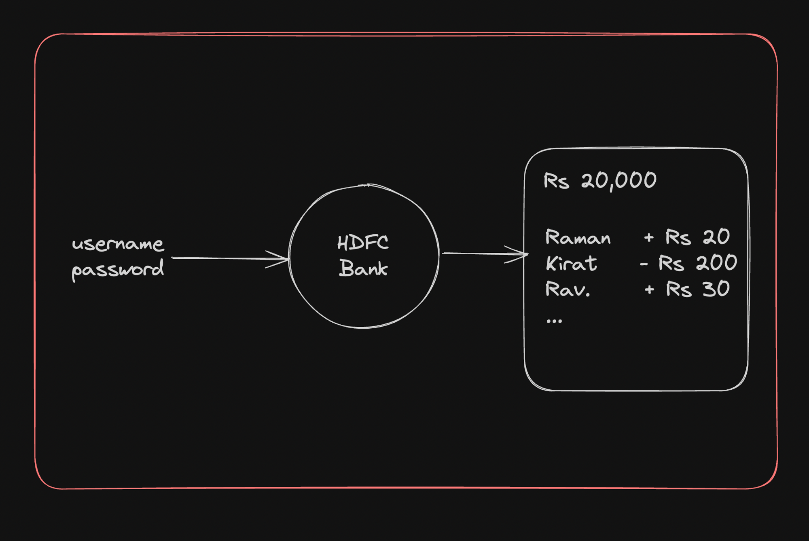
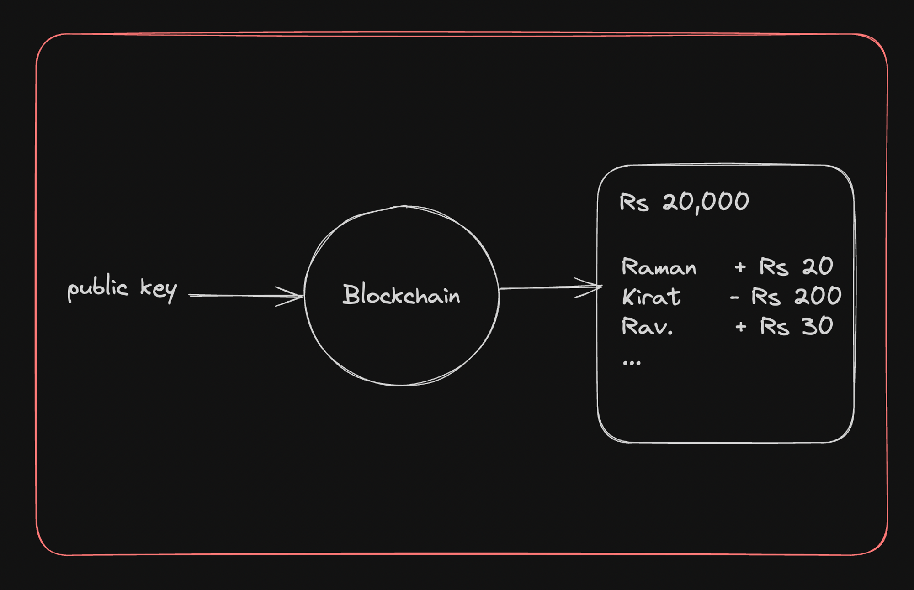
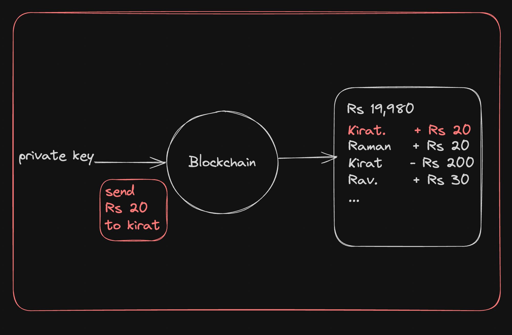

# Week 2: Public key cryptography

### Contents
- [**Banks vs Blockchains**](#banks-vs-blockchains)  
    - [**How do banks authenticate user?**](#how-do-banks-authenticate-user)  
    - [**How do blockchains authenticate user?**](#how-do-blockchains-authenticate-user)
        - [**Public private Key pair**](#public-private-key-pair)

## Banks vs Blockchains
Blockchain and traditional banking systems are both used to manage and record financial transactions, but they operate in fundamentally different ways. Here are the key differences between the two:
1. **Decentralization vs. Centralization**
    - **Blockchain**: Operates on a decentralized network with no single controlling entity. Transactions are validated through consensus mechanisms.
    - **Bank**: Centralized systems where banks control and manage transaction records.

2. **Transparency and Immutability**
    - **Blockchain**: Transactions are transparent and immutable, meaning they cannot be altered once recorded.
    - **Bank**: Transactions are recorded in private ledgers, which can be modified if necessary.

3. **Intermediaries**
    - **Blockchain**: Eliminates the need for intermediaries, allowing peer-to-peer transactions.
    - **Bank**: Acts as intermediaries, which can introduce delays and additional costs.

4. **Access and Inclusion**
    - **Blockchain**: Accessible to anyone with internet access, potentially reaching unbanked populations.
    - **Bank**: Requires customers to meet specific criteria, which may exclude some people.

5. **Security**
    - **Blockchain**: Offers strong security through decentralization and cryptography but can be vulnerable to issues like poor key management.
    - **Bank**: Uses centralized security systems, which can be targets for hacking but have strong protections and insurance.

6. **Regulation**
    - **Blockchain**: Less regulated, with evolving legal frameworks.
    - **Bank**: Highly regulated to protect consumers and ensure financial stability.

Both blockchain and banks have distinct strengths and limitations, catering to different needs in the financial ecosystem.

### How do banks authenticate user?
In traditional banks, you have a username and password that are enough for you to
*look at your funds*, *transfer funds*, *look at your existing transactions*, etc.

### How do blockchains authenticate user?
If you ever want to create an **account** on a blockchain, you need to generate a **public-private** key pair. The **public key** is used to *identify your account*, while the **private key** is used to *sign transactions* and *prove ownership of the account*. This means that only you can access your account and perform transactions on it.

#### Public private Key pair
A `public-private` key pair is a set of two keys used in `asymmetric cryptography`. These two keys have the following characteristics:
- **Public Key:** The public key is a string that can be shared openly.
    - 
    - For example - [Etherscan](https://etherscan.io/address/0xD9a657ACB3960DB92AaaA32942019bD3c473FCCB)

- **Private Key:** The private key is a string that is kept secret and used to sign transactions.
    - 